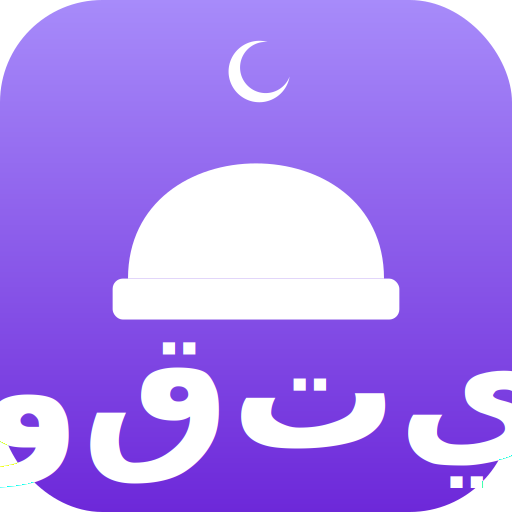

  
  <h1>Waqti (وقتي)</h1>
  

    <strong>Aplikasi Waktu Shalat untuk Penggunaan Pribadi dan Tampilan Jam Digital Masjid</strong>
  

  

    <em>Sebuah Pengingat Janji Temu Anda dengan Sang Pencipta.</em>
  

---

## Proyek Kolaborasi Unik: Manusia & AI

Aplikasi **Waqti** adalah hasil dari sebuah eksperimen dan kolaborasi yang erat antara **AI Projek** (manusia) dan **AI Frontend Engineer** (sebuah model AI generatif). Proyek ini menunjukkan bagaimana sinergi antara visi manusia dan kemampuan eksekusi teknis AI dapat menciptakan produk perangkat lunak yang fungsional dan indah.

### Peran Kami Masing-Masing

Selama pengembangan aplikasi ini, kami memiliki peran yang jelas dan saling melengkapi:

**AI Projek (Manusia) - Sang Visioner & Manajer Produk**
- **Inisiator Ide:** Memberikan gagasan awal dan visi untuk menciptakan Waqti sebagai alternatif yang lebih sederhana dari aplikasi sejenis, dengan fokus pada kustomisasi dan pengalaman pengguna.
- **Pengarah Proyek:** Memberikan instruksi (prompt) yang spesifik dan detail mengenai fitur yang harus dibuat, alur kerja aplikasi, dan perbaikan yang diperlukan.
- **Penyedia Aset:** Menyediakan aset-aset kunci seperti logo `icon.svg` yang menjadi identitas visual aplikasi.
- **Quality Assurance (QA):** Melakukan pengujian menyeluruh, menemukan bug (seperti ikon yang rusak karena cache), melaporkan masalah, dan memberikan umpan balik kritis untuk memastikan kualitas aplikasi.
- **Ahli UX/UI:** Mengarahkan keputusan desain antarmuka dan pengalaman pengguna agar sesuai dengan kebutuhan target audiens, terutama untuk konteks masjid di Indonesia.

**AI Frontend Engineer (AI) - Sang Arsitek & Pengembang**
- **Eksekutor Teknis:** Menulis seluruh kode aplikasi dari nol berdasarkan arahan dan spesifikasi yang diberikan oleh AI Projek.
- **Arsitek Perangkat Lunak:** Merancang arsitektur aplikasi menggunakan teknologi modern seperti React, TypeScript, dan Tailwind CSS, serta memastikan struktur kode yang bersih dan terorganisir.
- **Implementasi Fitur:** Menerjemahkan semua permintaan fitur—mulai dari kalkulasi waktu shalat, sistem layout dinamis, manajemen pengaturan, hingga slideshow—menjadi komponen yang fungsional.
- **Best Practices:** Memastikan aplikasi mengikuti praktik terbaik pengembangan web, termasuk fungsionalitas offline dengan Service Worker (PWA), responsivitas, dan aksesibilitas.
- **Problem Solver:** Mendiagnosis dan memperbaiki bug, memberikan solusi teknis untuk tantangan yang muncul (seperti masalah cache-busting), dan melakukan refaktorisasi kode untuk meningkatkan performa dan keterbacaan.

Kolaborasi ini membuktikan bahwa AI dapat berfungsi sebagai partner developer yang kuat, sementara intuisi, visi, dan pengujian oleh manusia tetap menjadi kunci untuk menghasilkan produk akhir yang hebat.

---

## Tentang Waqti

**Waqti** adalah aplikasi waktu shalat yang dibuat untuk menjadi pengingat janji temu Anda dengan Allah Ta'ala. Terinspirasi dari *Mawaqit.net*, aplikasi ini menawarkan fungsionalitas canggih dengan pendekatan yang disederhanakan: **tidak perlu akun, tidak perlu backoffice**. Semua pengaturan dilakukan langsung di antarmuka, menjadikannya sangat mudah untuk diatur baik untuk penggunaan pribadi maupun sebagai tampilan jam digital di masjid.

Nama Waqti (وقتي) berarti "Waktuku", menekankan hubungan yang personal dengan waktu shalat.

## Fitur Utama

- **Waktu Shalat Otomatis:** Menghitung waktu shalat secara akurat berdasarkan kota dan metode kalkulasi yang dipilih dari berbagai lembaga internasional.
- **Kustomisasi Kalkulasi Mendalam:** Fleksibilitas penuh untuk menyesuaikan metode perhitungan, madhab (untuk waktu Asar), aturan lintang tinggi, hingga mengatur sudut Subuh & Isya secara manual.
- **Koreksi Manual & Iqamah:** Atur koreksi waktu (maju/mundur) per shalat dalam hitungan menit, dan tentukan durasi jeda menuju iqamah untuk setiap waktu shalat.
- **Mode Jum'at Cerdas:** Alur kerja khusus untuk hari Jum'at, termasuk kemampuan untuk mengikuti waktu Zuhur atau mengatur waktu manual, serta menampilkan pesan khutbah yang dapat disesuaikan.
- **Tiga Layout Tampilan Utama:**
    - **Fokus Jam:** Tampilan jam digital besar yang jelas dan mudah dibaca dari jauh.
    - **Dasbor Informasi:** Tampilan multifungsi yang menampilkan jam, jadwal shalat, serta ringkasan jadwal kajian dan keuangan.
    - **Minimalis:** Desain sederhana yang hanya menyorot jam utama dan shalat berikutnya.
- **Slideshow Dinamis & Serbaguna:** Tampilkan informasi penting yang bergantian dengan jam utama. Mendukung empat jenis slide:
    - **Teks:** Tampilkan pengumuman atau kutipan dengan editor *rich text*.
    - **Gambar:** Tampilkan gambar dari URL atau unggah langsung dari perangkat.
    - **Jadwal Kajian:** Buat daftar jadwal kajian atau kegiatan masjid yang rapi.
    - **Laporan Keuangan:** Sajikan laporan keuangan kas masjid secara transparan, lengkap dengan grafik visual pemasukan dan pengeluaran.
- **Personalisasi Visual:**
    - **Tema Gelap & Terang:** Sesuaikan tema sesuai kondisi pencahayaan.
    - **Warna Aksen:** Pilih warna sorotan utama untuk menyesuaikan dengan identitas visual masjid atau selera pribadi.
    - **Wallpaper Kustom:** Ganti gambar latar belakang utama melalui URL atau unggah gambar.
- **Wallpaper Kontekstual:** Atur wallpaper berbeda untuk setiap periode waktu shalat (Subuh, Zuhur, Asar, Magrib, Isya) yang akan berubah secara otomatis.
- **Teks Berjalan Informatif:** Tampilkan pengumuman, pesan kustom, atau konten Islami (ayat Al-Qur'an & hadits pilihan) yang bergerak di bagian bawah layar.
- **Tampilan Dzikir Kustom:** Rangkaian dzikir setelah shalat yang dapat diaktifkan, diurutkan, ditambah, atau dikurangi sesuai keinginan.
- **Dukungan Offline (PWA):** Aplikasi dapat diinstal di desktop atau perangkat mobile dan akan tetap berfungsi sepenuhnya (termasuk jadwal shalat dan slide) bahkan tanpa koneksi internet.
- **Mode Orientasi Responsif:** Desain antarmuka yang beradaptasi secara otomatis untuk tampilan _landscape_ (layar lebar) maupun _portrait_ (layar tinggi).
- **Manajemen Data Mudah:** Ekspor semua pengaturan Anda ke dalam sebuah file untuk dicadangkan, dan impor kembali dengan satu klik untuk memulihkan atau memindahkan konfigurasi ke perangkat lain.

## Tumpukan Teknologi

- **Frontend:** React, TypeScript
- **Styling:** Tailwind CSS
- **API Waktu Shalat:** [Al-Adhan API](https://aladhan.com/prayer-times-api)
- **Offline & PWA:** Service Worker
- **Manajemen State:** React Context API
- **Penyimpanan Data:** IndexedDB dengan [Dexie.js](https://dexie.org/)
- **Editor Teks:** Quill.js
- **Grafik:** Recharts

## Cara Menggunakan

1.  **Akses Aplikasi:** Buka aplikasi melalui browser di URL yang tersedia.
2.  **Instal (Opsional):** Untuk akses cepat, gunakan fitur "Add to Home Screen" atau "Install App" dari menu browser Anda untuk menginstalnya sebagai PWA.
3.  **Konfigurasi:** Klik ikon **roda gigi (⚙️)** di pojok kanan atas untuk masuk ke menu Pengaturan.
4.  **Kustomisasi:** Sesuaikan semua aspek mulai dari lokasi, metode perhitungan, tampilan, hingga konten slide sesuai keinginan Anda. Semua perubahan disimpan secara otomatis di perangkat Anda.

## Lisensi

Proyek ini dilisensikan di bawah **GNU General Public License v3.0**. Lihat file `LICENSE` untuk detail lebih lanjut.

## Kontribusi & Dukungan

- **Diskusi:** Bergabunglah dengan [grup Telegram AI Projek](https://t.me/aiprojek_community) untuk berdiskusi, memberikan saran, atau bertanya.
- **Kode:** Proyek ini bersifat open-source. Kunjungi repositori [GitHub Waqti](https://github.com/aiprojek/waqti) untuk melihat kode sumbernya.
- **Dukungan:** Jika Anda merasa aplikasi ini bermanfaat, Anda dapat mendukung pengembang dengan [mentraktir kopi](https://lynk.id/aiprojek/s/bvBJvdA).
